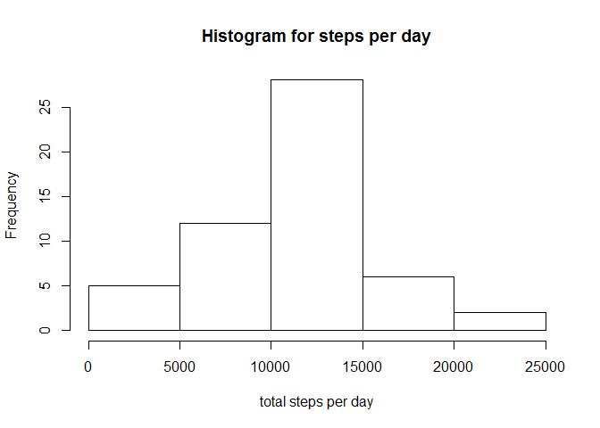
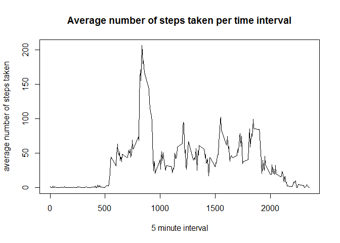
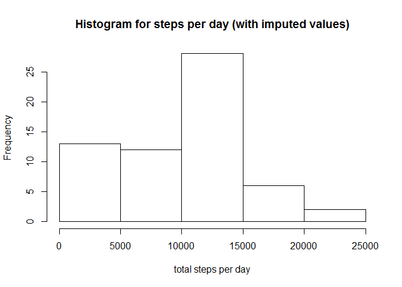
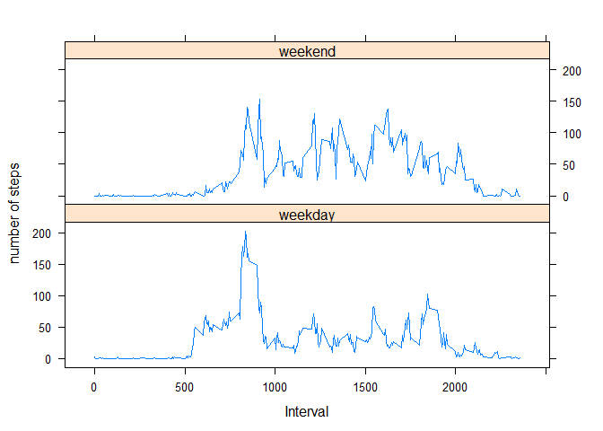

## Loading and preprocessing the data

We load the CSV file from the directory. Then, we convert the date column to the Date format. We load all
libraries that will give a bunch of boring messages. 


```r
 library(lubridate,quietly = TRUE)
```

```
## 
## Attaching package: 'lubridate'
```

```
## The following object is masked from 'package:base':
## 
##     date
```

```r
 library(stringr,quietly = TRUE)
 library(dplyr,quietly = TRUE)
```

```
## 
## Attaching package: 'dplyr'
```

```
## The following objects are masked from 'package:lubridate':
## 
##     intersect, setdiff, union
```

```
## The following objects are masked from 'package:stats':
## 
##     filter, lag
```

```
## The following objects are masked from 'package:base':
## 
##     intersect, setdiff, setequal, union
```

```r
 library(lattice, quietly= TRUE)
act <- read.csv("activity.csv")
act <- mutate(act,date=ymd(date))
```


## What is mean total number of steps taken per day?

To compute a histogram and basic statistics per day, we aggregate the data frame by the date and take the sum over all steps per date. 


```r
spd <- aggregate(act$steps,by=list(act$date),FUN=sum)
  
  
  hist(spd$x, main="Histogram for steps per day", xlab="total steps per day")
```

<!-- -->

```r
  View(spd)
  print(paste("Average number of steps per day: ",mean(spd$x,na.rm=TRUE)))
```

```
## [1] "Average number of steps per day:  10766.1886792453"
```

```r
  print(paste("Median number of steps per day: ",median(spd$x,na.rm=TRUE)))
```

```
## [1] "Median number of steps per day:  10765"
```


## What is the average daily activity pattern?

We create a data frame adap to compute and plot the average number of steps per day


```r
adap <- aggregate(act$steps,by=list(act$interval),FUN=mean, na.rm=TRUE)
plot(adap$Group.1,adap$x, type="l", xlab="5 minute interval", ylab="average number of steps taken", 
     main="Average number of steps taken per time interval")
```

<!-- -->

```r
index <- which(adap$x == max(adap$x,na.rm=TRUE))
print(paste("Time interval with the maximum number of steps is: ",adap$Group.1[index]))
```

```
## [1] "Time interval with the maximum number of steps is:  835"
```


## Imputing missing values

We choose to impute missing values by replacing NA by the minimum value found for that interval. It is easily replaceable by any other operator.


```r
  median_int <- aggregate(act$steps,by=list(act$interval),FUN=min, na.rm=TRUE)
  for(i in 1:nrow(act)){
    if(is.na(act$steps[i])){
      # assign the average value
      index <- which(median_int$Group.1 == act$interval[i])
      act$steps[i] <- median_int$x[index]
      
    }
    
  }
  
  spd2 <- aggregate(act$steps,by=list(act$date),FUN=sum)
  hist(spd2$x, main="Histogram for steps per day (with imputed values)", xlab="total steps per day")
```

<!-- -->

```r
  print(paste("Average number of steps per day: ",mean(spd2$x)))
```

```
## [1] "Average number of steps per day:  9354.22950819672"
```

```r
  print(paste("Median number of steps per day: ", median(spd2$x)))
```

```
## [1] "Median number of steps per day:  10395"
```


## Are there differences in activity patterns between weekdays and weekends?

We created this document under a Dutch operating system, where Saturday is "zaterdag" and Sunday is "zondag". For replication, please check the settings of your OS.


```r
act <- mutate(act, daytype = ifelse(weekdays(act$date)=="zaterdag" | weekdays(act$date)=="zondag","weekend", "weekday"))

spd2 <- aggregate(act$steps,by=list(act$daytype,act$interval),FUN=mean, na.rm=TRUE)
xyplot(x ~Group.2 | Group.1, data = spd2, type = "l", ylab="number of steps", xlab= "Interval", layout = c(1, 2))
```

<!-- -->


